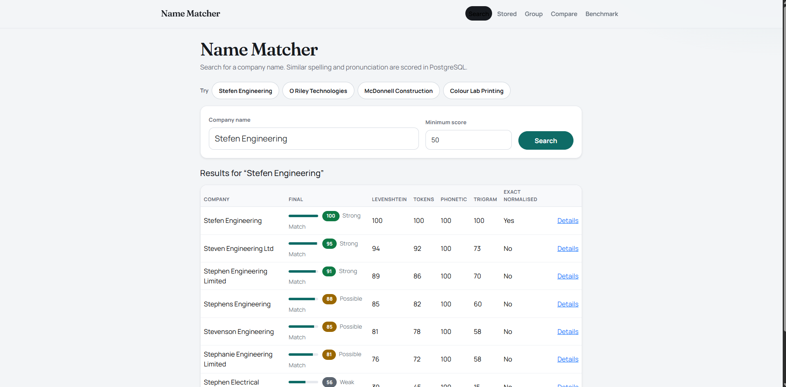
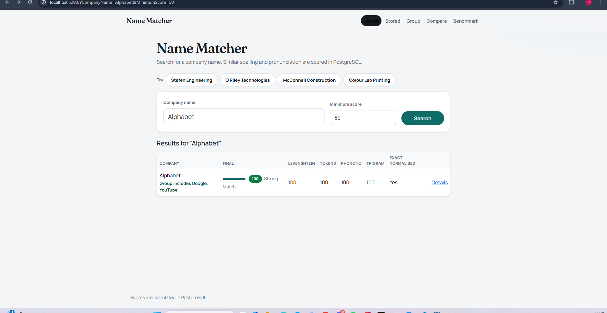
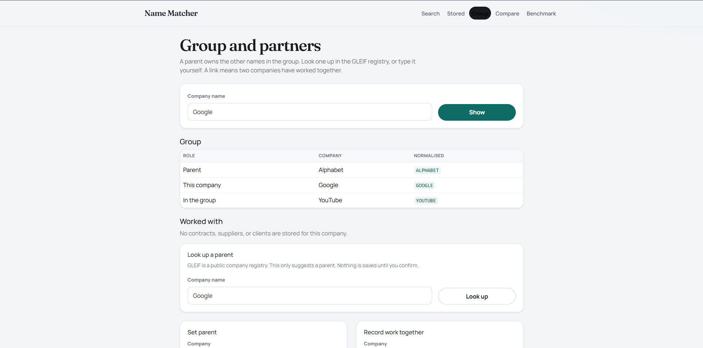
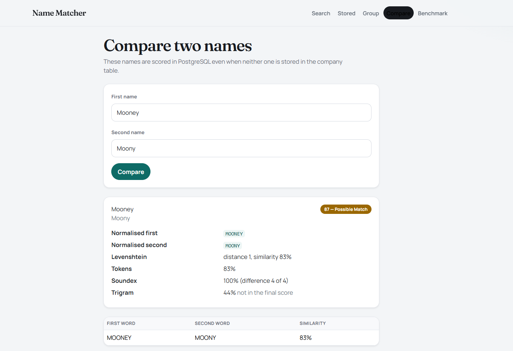
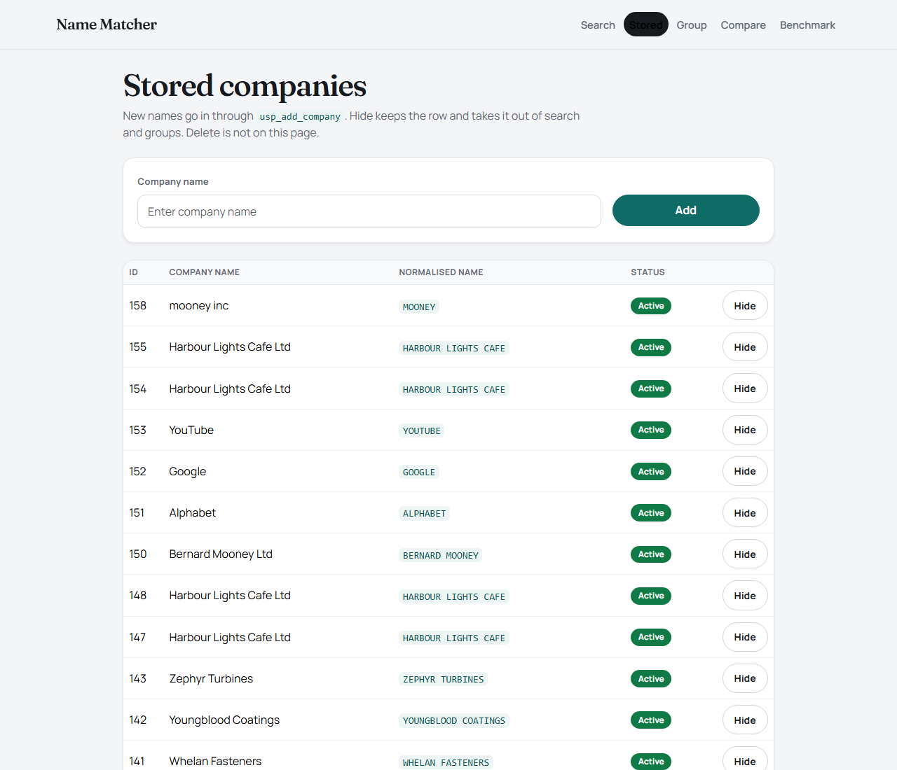
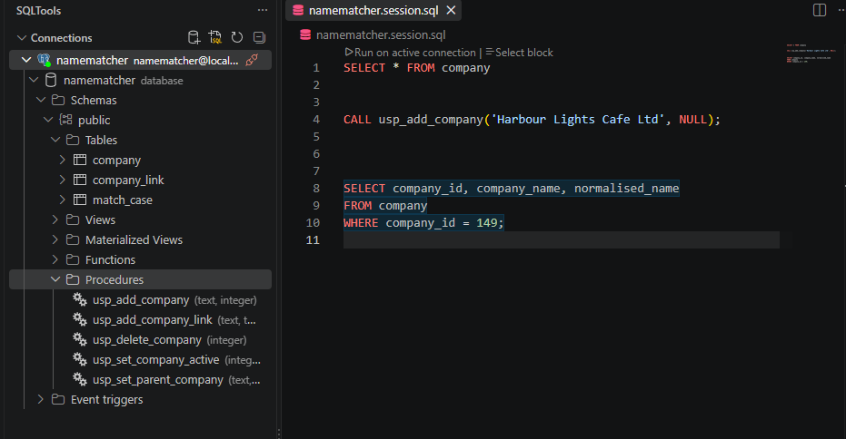
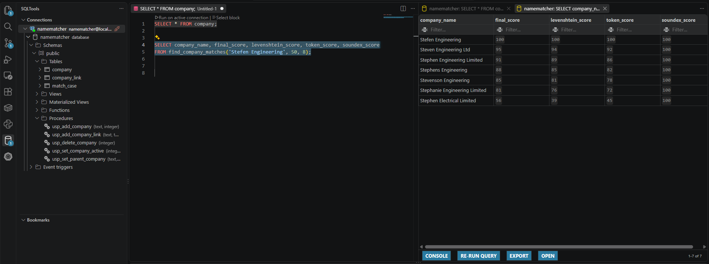

# Name Matcher

Name Matcher searches stored company names for close spelling and pronunciation. PostgreSQL does the matching. The ASP.NET Core site checks the input, calls a SQL function, and shows the ranked rows.

Five pages share one database:

| Page | What it does |
| --- | --- |
| Search | Scores stored names against the text you type |
| Stored | Adds a name, or hides it so search and groups skip it |
| Group | Shows a parent company, and any contract, supplier, or client link |
| Compare | Scores two names even when neither is stored |
| Benchmark | Re-runs a fixed set of spelling cases |

## Screenshots

### Search

Search for **Stefen Engineering**. Stefen itself is an exact normalised match, so it scores 100. Steven and Stephen stay in the Strong band because the spellings are close and the sound matches. Stephens, Stevenson, and Stephanie fall to Possible. Stephen Electrical is only Weak: the first name is close, and the second word is different.

The badge is a label for people. It does not change the number from SQL. 90–100 is Strong, 75–89 is Possible, and 50–74 is Weak. Rows under the minimum score, 50 by default, are left out.



### A group is not a spelling match

Search for **Alphabet** and the only name match is Alphabet, at 100. Google and YouTube do not look or sound like Alphabet, so they do not get their own rows.

The green line under the name is the ownership note: **Group includes Google, YouTube**. That line is loaded from the group tables. Click it to open the Group page.



### Group

Open Group and show **Google**. Alphabet is the parent. Google is the company you asked for. YouTube is the other member of that group. Worked-with links are a separate list. Google has none. Smith and Sons Building has one: a contract with Acme Hardware Limited.

A parent can be looked up in the public GLEIF registry, or typed in. The lookup only suggests a parent. Nothing is saved until you confirm it.



### Compare

Compare scores **Mooney** against **Moony** without looking in the company table. One letter changes, so the final score is 87, a Possible Match. The page shows the normalised forms, the Levenshtein distance, the token score, the Soundex difference, and the trigram figure. Trigram is there so you can compare it. It is not part of the final blend.



### Stored companies

Stored lists every company, newest first, including hidden ones. The normalised name is what search actually compares. **Active** means the row is included in search and in groups. **Hide** sets `active` to false and leaves the row in the table. Restore puts it back. Delete is a stored procedure, and this page does not call it.

The same name can be added more than once. Each add is a new row.



## Architecture

```
src/NameMatcher.Web             Razor Pages for the five screens
src/NameMatcher.Core            Requests, results, validation, Strong / Possible / Weak labels
src/NameMatcher.Infrastructure  Dapper calls to PostgreSQL, and the GLEIF lookup
database/schema                 company table and indexes
database/functions              normalisation, scoring, search, compare
database/procedures             add, hide, parent, link, delete
database/relationships          parent column, company_link, group functions, sample group
database/active                 active column for an existing database
database/seed                   sample company names and labelled match cases
database/tests                  SQL checks you can run in psql
tests/NameMatcher.Tests         C# validation tests and a database test
docker                          PostgreSQL 17
```

C# validates the request, calls the database, maps the rows, and renders them. It does not calculate similarity. The only C# that is not a SQL call is the GLEIF parent suggestion.

## How matching works

`find_company_matches(name, minimum_score, max_results)` normalises the search text, drops unlikely rows, scores what remains, and returns the top results. The defaults are a minimum of 50 and a maximum of 20.

A stored company is scored only when it is active and any of these are true:

- Soundex `difference` is 2 or more
- the first three letters match
- both names share a word of 4 or more letters
- the lengths are close and the first two letters match
- trigram similarity is at least 0.30

That filter decides who gets a Levenshtein score. It is not the final rank. Trigram overlap of 0.30 is deliberately low.

`explain_company_match(name, company_id)` scores one company even when the filter would have skipped it. The Details page uses that, so the explanation still comes from SQL.

`compare_company_names` uses the same blend for two pieces of text. Neither name has to be stored.

### Score

`fn_score_normalised_names` scores one pair of already-normalised names:

- exact normalised match: **100**
- otherwise: **45%** full-string Levenshtein, **30%** token Levenshtein, **25%** phonetic

`fn_token_similarity` pairs each word with the closest unused word in the other name, then divides by the longer word list, so an extra word lowers the score. Details shows those pairs.

`fn_trigram_score` is returned beside the blend. It is not one of the three weights.

### Levenshtein

`fn_levenshtein_distance` is edit distance: one insert, delete, or substitution counts as one. `kitten` to `sitting` is 3.

`fn_levenshtein_similarity` turns that into 0–100:

```
round((1 - distance / max(length1, length2)) * 100)
```

Identical strings score 100.

### Soundex

`fuzzystrmatch` supplies `soundex()` and `difference()`. `difference()` runs from 0 to 4. 4 means the codes match.

`fn_phonetic_score` maps that onto 0–100:

| difference | score |
| --- | --- |
| 4 | 100 |
| 3 | 75 |
| 2 | 40 |
| 1 | 15 |
| 0 | 0 |

Soundex describes how the start of the name sounds. A high phonetic score is one input to the blend. `is_phonetic_match` is true when `difference` is 3 or 4.

## Normalisation

`fn_normalise_company_name` runs in a trigger on insert and update, and again on whatever you type into search:

- uppercases the text
- turns `&` into `AND`
- removes apostrophes, so `O'Reilly` and `OReilly` both become `OREILLY`
- removes dots, then other punctuation
- collapses spaces
- joins a leading initial to the next word when that word is at least four letters (`O Riley` becomes `ORILEY`)
- strips a trailing `LTD`, `LIMITED`, `LLC`, `INC`, `PLC`, `COMPANY`, or `CO`

`O'Reilly Technologies Limited` becomes `OREILLY TECHNOLOGIES`.

## Database

The site is a view over this database. SQLTools is connected to `namematcher` on localhost. The public schema holds three tables: `company`, `company_link`, and `match_case`. Writes are the procedures in that list: add a company, add a worked-together link, delete, hide or restore, and set a parent.



The same Stefen search the website shows can be run directly:

```sql
SELECT company_name, final_score, levenshtein_score, token_score, soundex_score
FROM find_company_matches('Stefen Engineering', 50, 8);
```

Stefen is 100. Steven is 98. Stephen Engineering Limited is 91. The phonetic column is 100 for every row in that set, because the names start with the same sound. The site renders this grid. It does not rescore it.



After the scripts have run, `company` stores:

| Column | Purpose |
| --- | --- |
| company_id | Identity key |
| company_name | Name as entered |
| normalised_name | Filled by the trigger |
| active | True includes the row in search and groups. False hides it |
| parent_company_id | The owning company, or null. One level: a parent and the companies that point at it |
| created_at | Insert time |

Indexes cover the normalised name, its first three letters, and `soundex(normalised_name)`. `pg_trgm` is installed for the candidate filter and the trigram column. There is no separate trigram index.

`company_link` stores a worked-together relationship: contract, supplier, or client, plus a short note. It is not ownership.

Writes go through procedures: `usp_add_company`, `usp_set_company_active`, `usp_set_parent_company`, `usp_add_company_link`, and `usp_delete_company`. Reads stay as functions, including `find_company_matches`, `explain_company_match`, `compare_company_names`, `fn_list_stored_companies`, `fn_company_group`, and `fn_group_summary`.

The relationship script also inserts the sample group, if those names are missing: Alphabet owns Google and YouTube. It inserts one sample contract between Smith and Sons Building and Acme Hardware Limited.

## Run it

Docker Desktop and the .NET 10 SDK are required.

From the project folder:

```powershell
docker compose -f docker/docker-compose.yml up -d
dotnet run --project src/NameMatcher.Web --launch-profile http
```

Open http://localhost:5290. Leave that command running. Ctrl+C stops the site and leaves the database running.

The local database login is user `namematcher`, password `namematcher`, database `namematcher`, port `5432`. That login is for this demo database only.

Stop the database without deleting data:

```powershell
docker compose -f docker/docker-compose.yml stop
```

Init scripts run only when the data volume is created. `docker compose down -v` deletes that volume, including every company added after the seed. Use it only when you mean to wipe the database and load the scripts again.

A second viewer, pgweb, is included in the same compose file at http://localhost:8081. It is already connected to this database.

## Tests

SQL, after the container is healthy:

```powershell
Get-Content database/tests/test_matching.sql -Raw |
  docker exec -i namematcher-postgres psql -U namematcher -d namematcher
```

C#:

```powershell
dotnet test NameMatcher.slnx
```

The Benchmark page runs `evaluate_match_cases()` against the rows in `match_case`. It checks the scorer. It is not a search screen.

## Example searches

| Search | What you should see |
| --- | --- |
| Stefen Engineering | Stefen at 100, then Steven and Stephen in the Strong band |
| Steven Engineering Ltd | Stephen, Stephens, and Stevenson nearby |
| OReilly Technology Ltd | O'Reilly Technologies Limited as an exact or very high score |
| O Riley Technologies | O'Reilly, close, and not always exact |
| McDonnell Construction | MacDonnell above McDonald |
| ACME Software Ltd | Acme Software Limited at 100 |
| Alphabet | Alphabet at 100, with the line Group includes Google, YouTube |
| Stephen Engineering Limited | Unrelated names such as Zenith Logistics stay under 50 |

Open **Details** on a row to see the normalised forms, the edit distance, the Soundex difference, the token pairs, and the final score.
